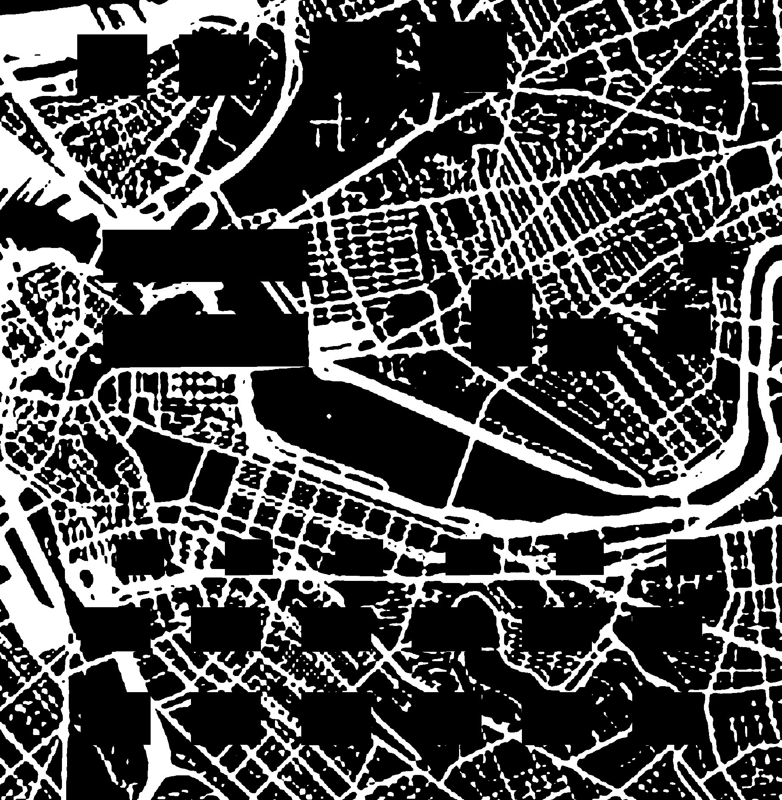

# Map Generator
Auto generates back map for Eagle PCBs w/masks over bottom layer lettering. 
Bottom layer lettering is useful for denoting signals, placing pass-thrus, 
etc. See example pcb and map below.

## Contents
1. [Example PCB Input](#example-pcb-input)
2. [Example Map Output](#example-map-output)
3. [Constraints](#constraints)
4. [Usage](#usage)
5. [Install](#install)
6. [Troubleshooting](#troubleshooting)

## Example PCB Input


## Example Map Output


## Constraints
The bPlace lettering must be contained in a closed rectangular box w/6 mil 
width. The border for the map graphic must also be placed on the bottom 
silkscreen layer (bPlace) with 6 mil width. This border should be placed 100 
mils from the outer board dimension.

## Usage
1. Install map-generator, see [Install](#install)
2. Export bplace layer from Eagle PCB as monochromatic bitmap w/400 DPI 
   resolution with file name `pcb.bmp`
3. Place `pcb.bmp` in `map-generator/data` directory
4. Run `python generate.py` to create `map.bmp` in `map-generator/data` 
   directory. Note if you installed with the virtual environment, you will need
   to activate it by running `source venv/bin/activate` from `map-generator`
   directory.
5. Create new Eagle part in the `openag-frames` library named specific to the
   board (see examples in openag-frames)
6. Import `map.bmp` file into Eagle using `run import-bmp.ulp` script at 
   `400 DPI` resolution, onto `Layer 22` a.k.a. bPlace, and select the
   `Black` color.
7. Save part and add to board, finish the back outline box that matches the 
   pattern used by the design block modules.

## Install
Create Virtual Environment
```
cd map-generator
pyvenv venv
```

Activate Virtual Environment
```
source venv/bin/activate
```

Install Python Requirements
```
pip install -r requirements.txt
```

## Troubleshooting
**Failed upload of `.brd` file to OSHPark (no bottom silkscreen layer)** <br>
When this happens, OSHPark's internal board processor will timeout (due to the 
large file size of the back map) and throw an error. To fix, generate the 
OSHPark gerber files and upload the zip. See OSHPark's `oshpark-2layer.cam`
file.

