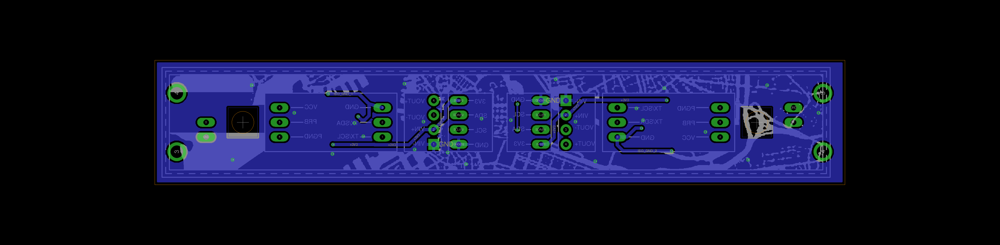

# Atlas Port Double v1.0
Port for connection x2 Atlas Probes. Includes isolation circuitry
and recepticle for atlas stamp. Has headers and mounting point for
connection with larger board.

### Contents
1. [Schematic](#schematic)
2. [Board](#board)
2. [Board Top](#board-top)
3. [Board Bottom](#board-bottom)
4. [Bill of Materials](atlas_double.csv)
5. [Gerber Files](atlas_port_double_v_1_0.zip)

### Schematic

### Board

### Board Top

### Board Bottom
