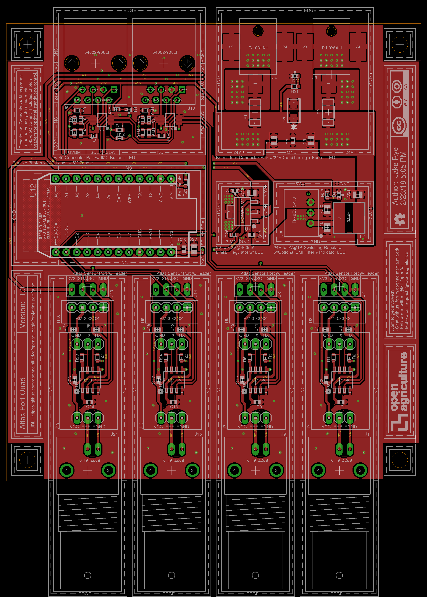

# Atlas Port Quad v1.0
Connects x4 Atlas probes 
to the nervous system board via
RJ45-dI2C comms. Includes photon
headers for optional standalone control.

### Contents
1. [Schematic](#schematic)
2. [Board](#board)
2. [Board Top](#board-top)
3. [Board Bottom](#board-bottom)
4. [Bill of Materials](atlas_quad.csv)
5. [Gerber Files](atlas_port_quad_v_1_0.zip)

### Schematic

### Board

### Board Top

### Board Bottom
