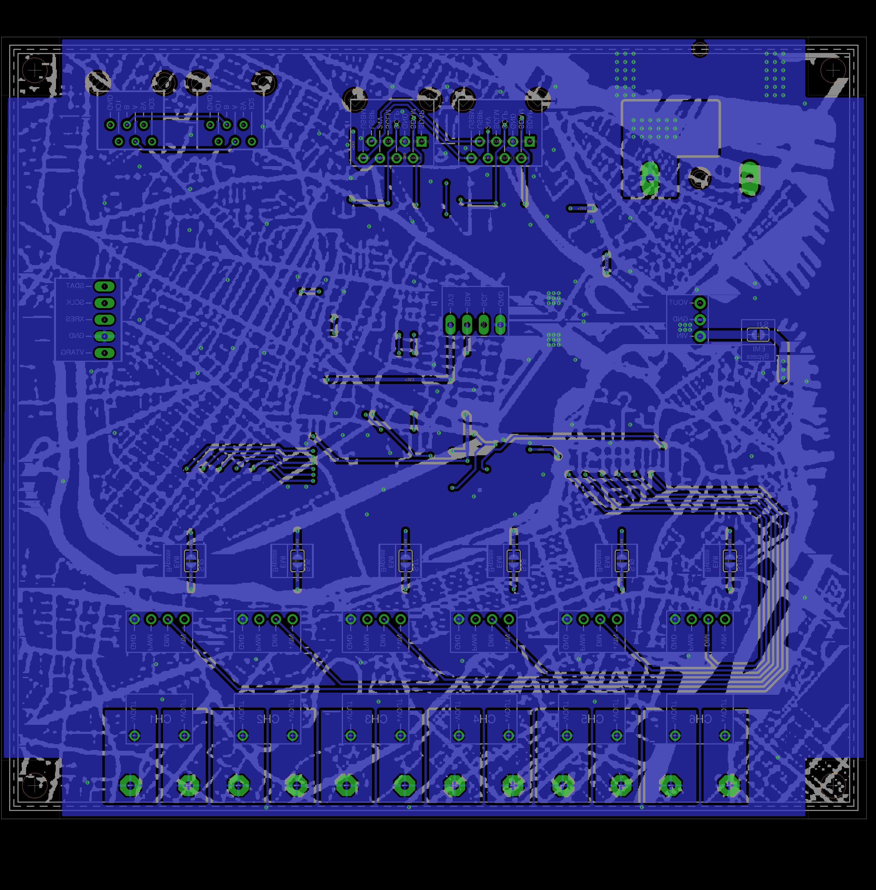

# Light Controller v2.1
Drives x6 channels of LEDs by regulating the current up to 700mA (per channel) at 24V.  Communicates via 
differential-I2C (dI2C) or RS485 (See enables on PSOC module). To communicate directly with the board ICs
and avoid programming the PSOC, enable I2C Connect. Current regulators can be driven by either dimming 
or PWM control. Allows for daisy chaining comms between multiple boards.

### Contents
1. [Schematic](#schematic)
2. [Board](#board)
2. [Board Top](#board-top)
3. [Board Bottom](#board-bottom)
4. [Bill of Materials](light_controller.csv)
5. [Gerber Files](light_controller_v_1_1.zip)

### Schematic

### Board

### Board Top

### Board Bottom
