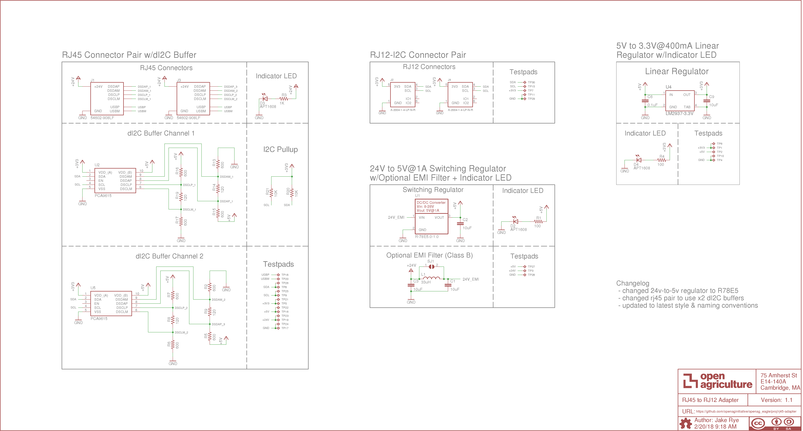
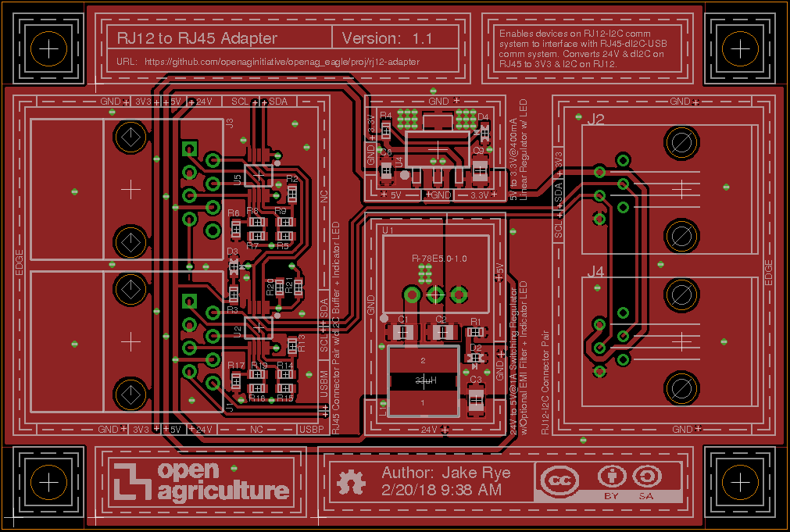
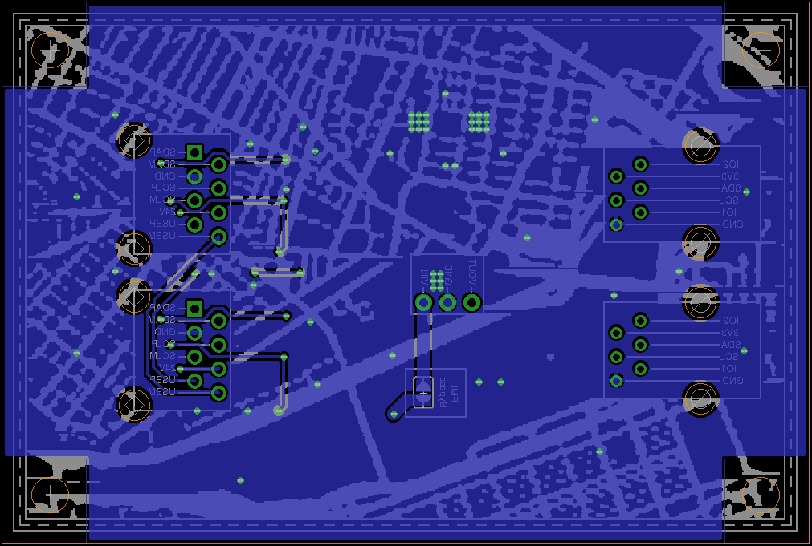

# RJ12 to RJ45 Adapter v1.1
Enables devices on RJ12-I2C comm
system to interface with RJ45-dI2C-USB
comm system. Converts 24V & dI2C on 
RJ45 to 3V3 & I2C on RJ12.

### Contents
1. [Schematic](#schematic)
2. [Board Top](#board-top)
3. [Board Bottom](#board-bottom)
4. [Bill of Materials](rj12_adapter.csv)
5. [Gerber Files](rj12_adapter_v_1_1.zip)

### Schematic

### Board Top

### Board Bottom
