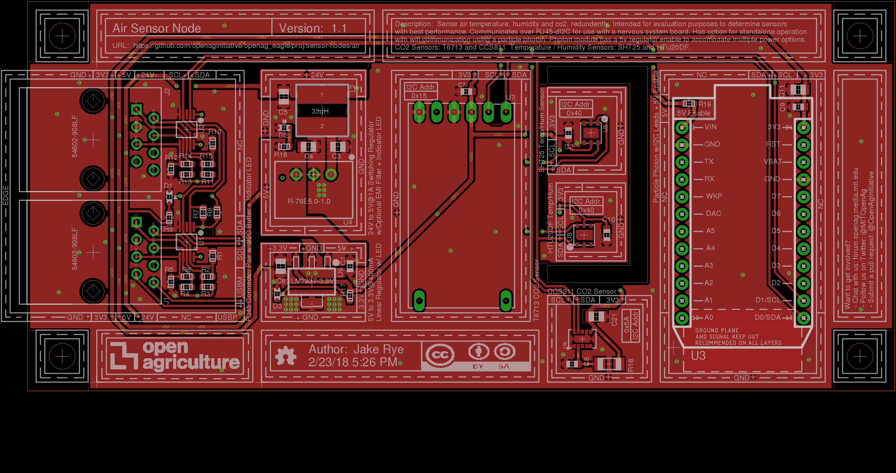
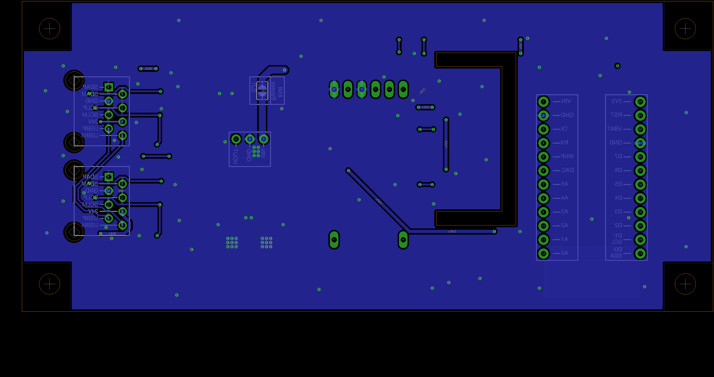

# Air Sensor Node v1.1
Sense air temperature, humidity and co2, redundently. Intended for evaluation purposes to determine sensors 
with best performance. Communicates over RJ45-dI2C for use with a nervous system board. Has option for standalone operation 
with wifi communication using a particle photon. Photon module has a 5v regulator enable to accomodate multiple power options. 
CO2 Sensors: T6713 and CCS811. Temperature / Humidity Sensors: SHT25 and HTU20DF.

### Contents
1. [Schematic](#schematic)
2. [Board](#board)
2. [Board Top](#board-top)
3. [Board Bottom](#board-bottom)
4. [Bill of Materials](air.csv)
5. [Gerber Files](air_sensor_node_v_1_1.zip)

### Schematic

### Board

### Board Top

### Board Bottom
